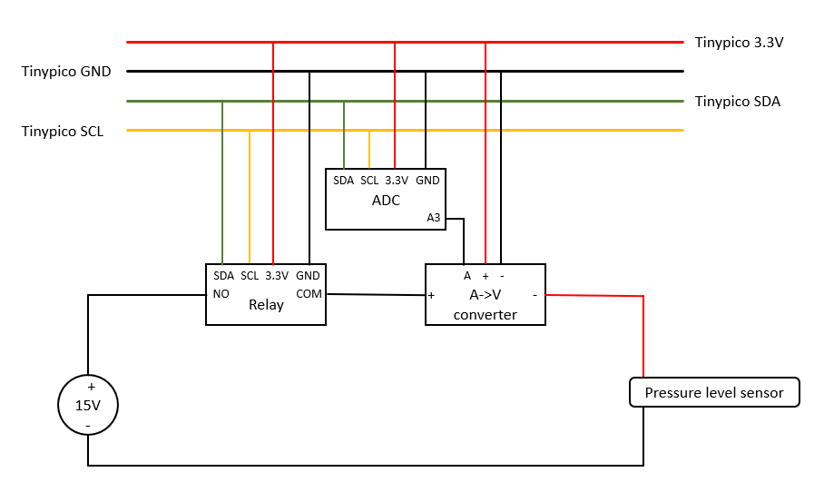

## BOM
Sonde niveau d'eau: https://wiki.dfrobot.com/Throw-in_Type_Liquid_Level_Transmitter_SKU_KIT0139  
Relai: https://www.sparkfun.com/products/15093  
Convertisseur courant-tension: https://www.dfrobot.com/product-1755.html    

## Montage
Le montage nécessaire pour reproduire ce datalogger est schématisé dans l'image ci-dessous.

## Remarque
Afin que le relai fonctionne correctement, la fréquence de l'I2C doit être de 100kHz.  