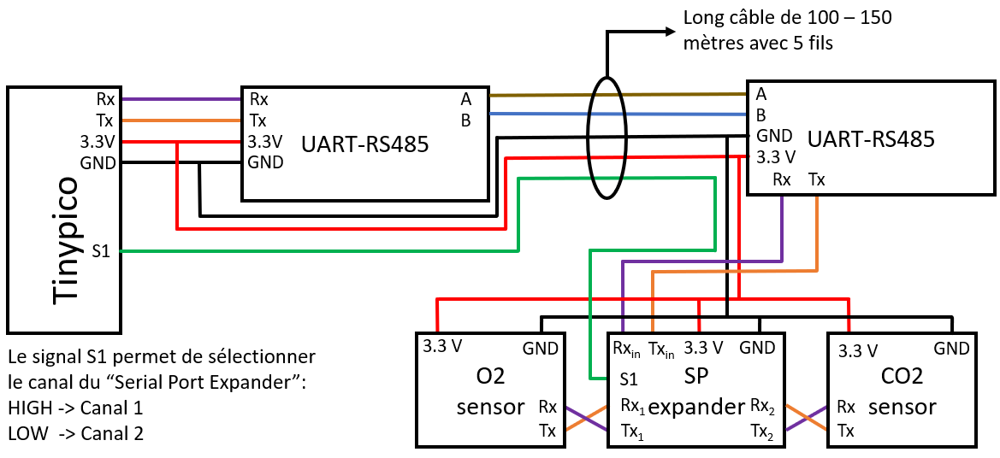

# TinyPico Low Power Board
## Communication RS485 
Pour ce datalogger, les capteurs CO2 et O2 sont au bout d'un câble d'environ 100 mètres. Afin de pouvoir transmettre les données sur cette distance, des transreceivers UART - RS485 sont utilisés. Un multiplexeur UART permet de communiquer avec les deux capteurs en utilisant un seul bus UART. 

## BOM
Multiplexeur UART: "Serial Port Expander" https://atlas-scientific.com/ezo-accessories/81-serial-port-expander/  
Capteur O2 UART: https://atlas-scientific.com/probes/oxygen-sensor/  
Capteur CO2 UART: https://atlas-scientific.com/probes/co2-sensor/  
Transreceiver UART - RS485 avec logique 3.3V: https://www.conrad.ch/fr/p/joy-it-joy-it-module-convertisseur-noir-2481412.html  

## Montage
Le montage nécessaire pour reproduire ce datalogger est schématisé dans l'image ci-dessous.

